[日本語のREADME](README_JA.md)
# UnityEditorMemo
  
You can post any texts on UnityEditor.  
You can post questions you had during your game dev or take notes about your tasks... This asset can be used in various ways.  

[AssetStore](https://assetstore.unity.com/packages/tools/utilities/unityeditormemo-81812)  
[Package](https://github.com/charcolle/UnityEditorMemo/releases)


# Supported version
Unity 2018 or newer

# Download by PackageManager
Add this text to your manifest.json.  
*NOTE: I think UnityEditorMemo's save data system is not optimized for PackageManager. Be careful to use this.*
``` 
"com.charcolle.unityeditormemo": "https://github.com/charcolle/UnityEditorMemoPackageManager.git" 
```

# Usage
[Youtube](https://www.youtube.com/watch?v=yL0bPQLsaRA)  


* [Open UnityEditorMemo](##Open-UnityEditorMemo)
* [Memo](##Memo)
* [Category](##Category)
* [Preference](##Preference)
* [SceneMemo](##SceneMemo)
* [Slack Integration](##Slack-Integration)


## Open UnityEditorMemo
Select [Window]->[UnityEditorMemo].

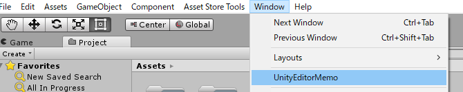

## Memo
The Memo-view displays the list of the memos you posted.  
The colored toggles at bottom of the view is called **Label**, and you can display only the selected label by selecting a colored toggle.
    
### Create Memo
To post a memo, enter the texts on the Post-view and press the [**Post**] button.  
Change the label from the drop-down menu beside the Date. Set emoji with the memo by selecting emoji beside the Post button.  
If you enter the URL on **the URL text field**, you can open the URL with the right-click context menu. 

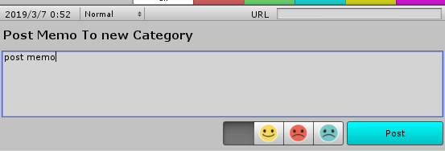

### Edit Memo
Edit a memo by **double click** or selecting **[Edit] at the right-click context menu**.  

When edit mode, you can change any memo contents exept for Date. Regarding label, you can change it from the right-click context menu.  
Exit edit mode from **double click** or selecting **[Done] at the right-click context menu**.   


### Delete
Delete a memo by **double click** or selecting **[Delete] at the right-click context menu**. 

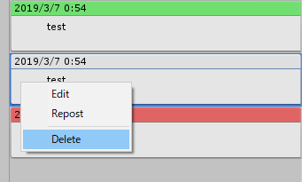

### Add an Asset to Memo
Add an Asset to the memo by drugging the Asset to the memo.  You can access the Asset quickly from UnityEditorMemo.  
When edit mode, you can remove the Asset from the memo.

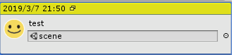

### Backup Memo
#### Export
Export all the memo data for data migration or backup. Select [**Export**] at [Menu] above the category view and export **.unitymemo** file. This file will be used for import the memo.

#### Inport
The output **.unityememo** file is reflected to the other project.
* Override...This mode will erase all current memo data and override it.
* Additive...This mode will not erase all current memo data and will add categories from the output file.

*Note: the default category will not be imported with Additive menu*

## Category

### Create Category
Create a category by selecting [**Create New Category**] at [Menu] above the category view.  
A category named [new Category] will be created and you can edit the name.

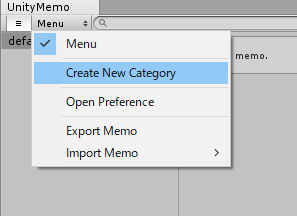

### Edit Category
Edit a category by selecting it for long time or selecting [**Rename**] at the right-click context menu.

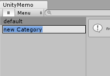

### Delete Category
Delete a category by **double click** or selecting **[Edit] at the right-click context menu**. 

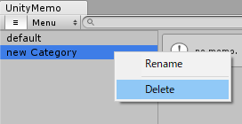

### Sort Category Order
Move to any position by dragging a category.

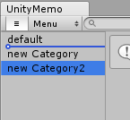

### Switch Category Display
Switch the display of the category view with **[≡] toggle**.

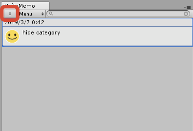

*Note: the default category will not be renamed nor deleted*


## Preference
Open the Preference window from [**Open Preference**] at [Menu] above the category view.  
You can edit the following settings.
* Size of memo font
* Name of the labels
* Enable UnitySceneMenu
* Enable Slack Integration

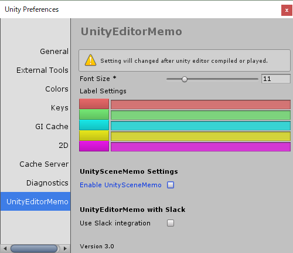

## SceneMemo
You can add a SceneMemo to the GameObject.  
*Note: the Scene the gameobject belonging to must be saved at Project.*

### Enable SceneMemo
Check [**Enable UnitySceneMemo**] at Preference window.  

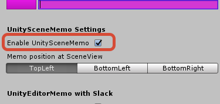

*NOTE: after activation, you must play UnityEditor or compile the scripts*

### Add a SceneMemo to the GameObject
Create a SceneMemo by selecting **[+] button** which displays when you select the GameObject.  A Balloon icon will be displayed and you can see the memo by selecting it.

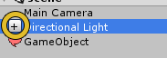


### Edit SceneMemo
Edit the SceneMemo content by selecting **[+] button** or selecting **[Edit] at the right-click context menu**.  
Change the SceneMemo color from drop-down menu at the footer.  
If you enable [**ShowAtScene**] toggle, the SceneMemo will be displayed at SceneView when you select the GameObject. 
The settings(color, size) displayed when enable [**ShowAtScene**] toggle affects the SceneMemo display at SceneView. 

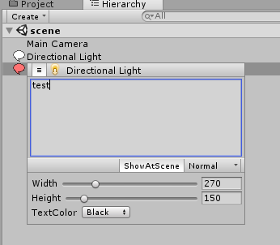

### Delete SceneMemo
Delete the SceneMemo by showing SceneMemo then selecting **[Delete] at the right-click context menu**. 

### Add SceneMemo to Memo
You can add SceneMemo to Memo by dragging the GameObject to the memo.

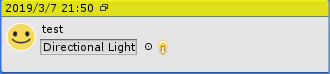


## Slack Integration
You can send the memo to Slack.

*NOTE: only send a memo, cannot edit a memo at Slack channel with UnityEditorMemo*

### Enable Slack Integration
Check [**Use Slack Integration**] at Preference window.  
Enter the AccessToken to send to your Slack channel.

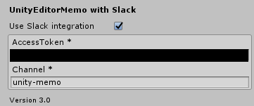

When enable Slack Integration, the Post view will be updated.

#### Send to Slack
The memo will be sent to your Slack channel only when enable **[Post to Slack]** toggle so you can send a memo when you want to.

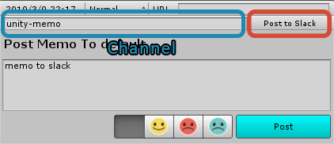
